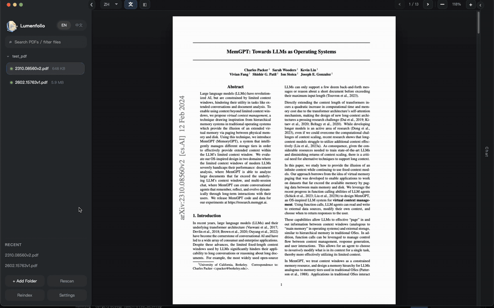
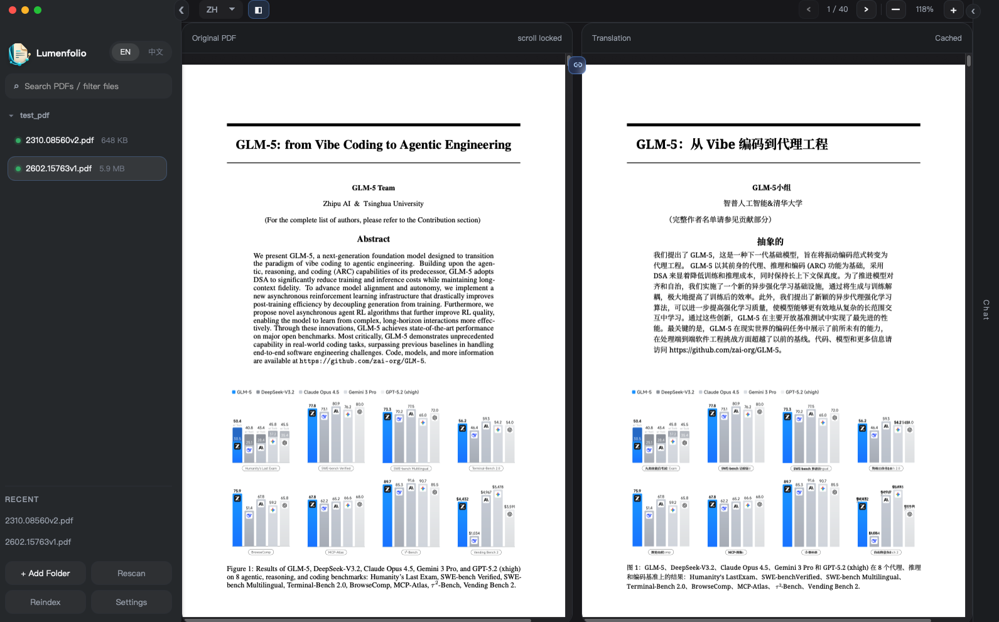
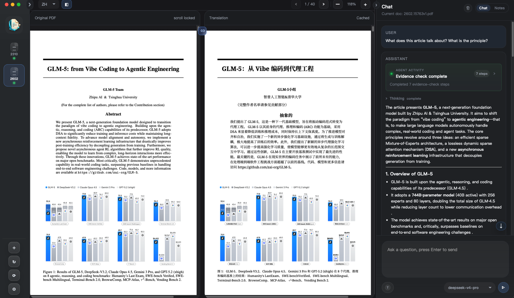
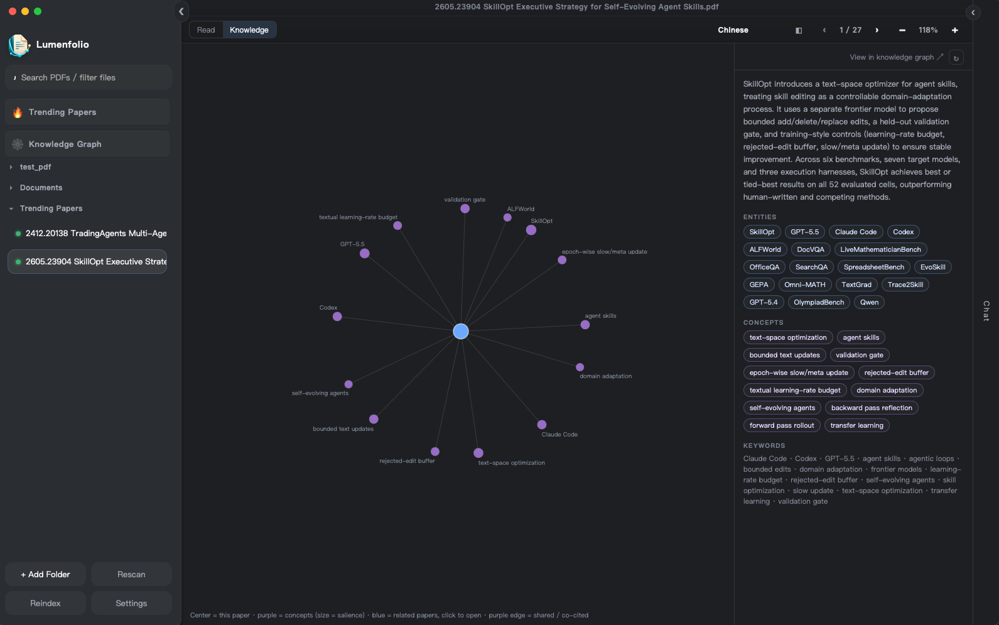
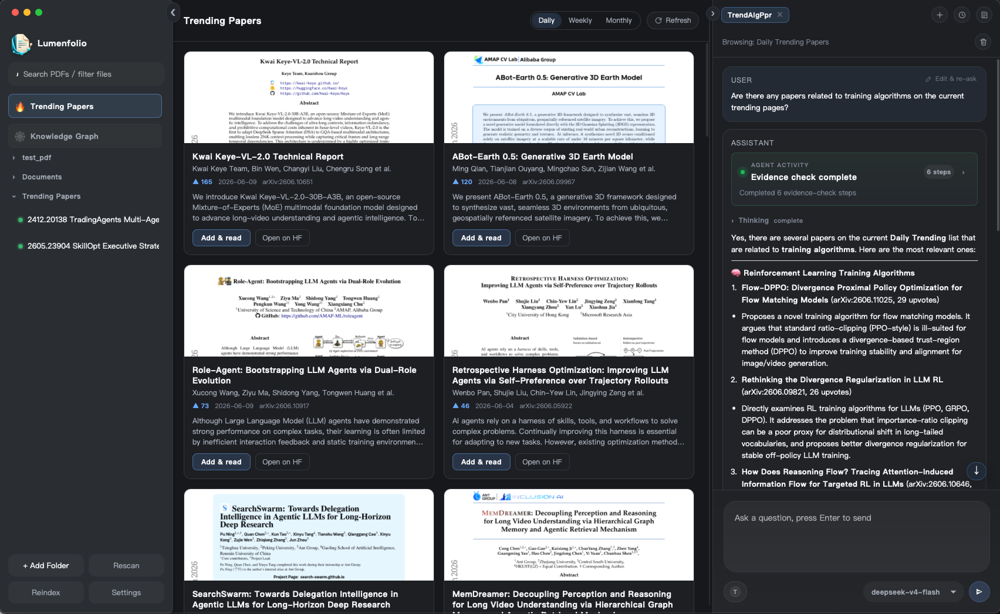
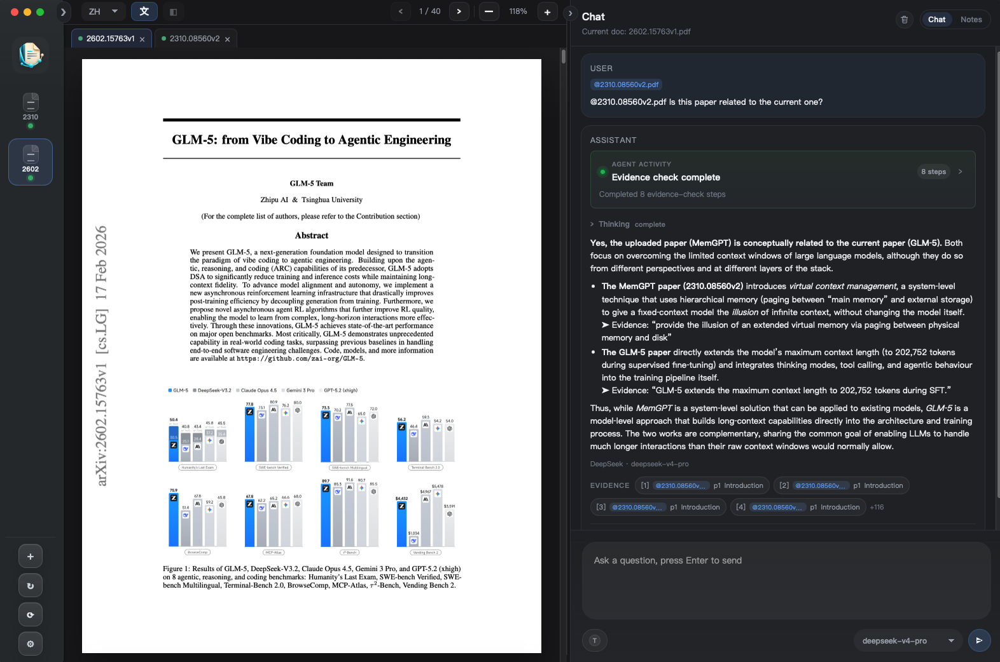

<div align="center">
  
  <h1>Lumenfolio</h1>
  <p><strong>Local-first AI paper reader with verifiable page/bbox evidence.</strong></p>
  <p>Ask questions, translate PDFs, inspect tables/figures, and use local Codex / Claude Code agents without uploading papers by default.</p>
  <p>
    <a href="https://github.com/tanghui315/lumenfolio/releases/latest"><strong>Download</strong></a>
    ·
    <a href="./docs/assets/lumenfolio-demo.gif"><strong>Watch 30s Demo</strong></a>
    ·
    <a href="https://github.com/tanghui315/lumenfolio/stargazers"><strong>Star on GitHub</strong></a>
    ·
    <a href="https://github.com/tanghui315/lumenfolio/issues"><strong>Give Feedback</strong></a>
  </p>
  <p>Available for macOS Intel, macOS Apple Silicon, and Windows x86_64.</p>
  <p><a href="./README.zh-CN.md">中文文档 (Chinese README)</a></p>
</div>

Lumenfolio is a local-first desktop AI reading workspace for academic PDFs. It combines a focused PDF reader, vectorless agentic RAG, layout-aware translation, evidence-anchored notes, OCR / TSR visual evidence, and local Codex / Claude Code agents into one reading environment.

It is not just "chat over a PDF". Lumenfolio is built around local document evidence: pages, blocks, chunks, structure, tables, visual regions, citations, and bounding boxes that can point back to the original PDF. That evidence can also be exposed through local MCP tools so your signed-in Codex / Claude Code CLI can gather evidence and answer inside the reading workflow.



If Lumenfolio helps your paper-reading workflow, a star helps more researchers discover it.

## Why Not Another PDF Chat?

| Capability | Typical PDF chat | Lumenfolio |
| --- | --- | --- |
| Evidence | Text snippets or loose citations | Page / bbox citations that jump back to the exact PDF region |
| Retrieval | Chunk + embedding + vector DB by default | PDF structure + SQLite FTS + page/block evidence loop; vectorless by default |
| Privacy | Often uploads documents to a hosted service | Local indexing first; cloud calls depend on the provider you choose |
| Tables and figures | Often treated as surrounding text | OCR, TSR-ready table evidence, visual crops, and figure/table inspection |
| Workflow | A chat box beside a file | Reader, translation, notes, evidence chain, agent trace, and local agents in one workspace |

## Screenshots

**Side-by-side PDF translation**



**Agentic RAG with evidence trace**



**Cross-document knowledge graph**



**Trending papers, queryable by the agent**



## Why Lumenfolio

Most PDF AI tools optimize for quick answers. Lumenfolio is designed for deep reading: following claims, checking citations, translating difficult sections, and keeping notes tied to the exact place where an idea appears.

The core product principles are:

- **Local-first by default**: PDFs, indexes, chat history, notes, provider settings, and API keys stay on the user's machine.
- **Evidence-grounded answers**: answers are expected to cite page-level and bbox-level evidence from the current PDF.
- **Vectorless agentic RAG**: retrieval does not require embeddings or a vector database.
- **Local agent providers**: use a locally installed Codex or Claude Code subscription as a chat model, without configuring a separate API key in Lumenfolio.
- **Layout-aware translation**: PDF translation is handled as a document-layout problem, not just plain text translation.
- **Anchored notes**: highlights and comments are attached to PDF coordinates and quotes, so they can jump back to the source.

## Vision

Lumenfolio aims to become a Cursor-like AI workspace for academic papers: a local-first environment where readers can translate, question, annotate, compare, and eventually analyze papers with an agent that understands document structure and stays grounded in verifiable evidence.

The long-term direction is not generic PDF chat. It is a paper analysis workspace with:

- citation-grounded reasoning over local PDFs
- structure-aware navigation across sections, figures, tables, and references
- translation and note-taking as part of the same reading loop
- multi-turn research memory for a paper or reading collection
- agentic workflows for summarizing claims, comparing methods, extracting experiments, and checking evidence

## Vectorless Agentic RAG

Lumenfolio's RAG pipeline is vectorless by design. It does not require an embedding model, vector database, or external retrieval service.

Instead, each PDF is indexed into a local, inspectable evidence layer:

- PDF pages, text blocks, lines, and chunks
- deterministic document structure tree
- SQLite FTS5 text search
- page and block bounding boxes
- table and visual evidence
- citation records with quote, page, and bbox metadata

At question time, the document agent uses retrieval tools rather than a single opaque similarity lookup:

```text
Question
-> inspect document structure
-> open relevant sections
-> search local FTS chunks
-> open pages, neighbors, tables, and visual evidence
-> run an answerability / finalize gate
-> answer with citations and evidence trace
```

This makes retrieval cheap to run locally, independent from embedding model quality, and easier to audit. The goal is not to replace every vector-search use case; it is to optimize for single-document scholarly reading where structure, page context, and verifiable citations matter.

On models that support native tool calling, this runs as a single agent loop: retrieval and answering share one growing context, so the agent stays aware of everything it has explored. Models without tool calling fall back to a rule-driven retrieval path, so weaker or local models keep working. The agent is also workspace-aware — it can see your whole indexed library, answer questions about it (for example "which of my papers is about X"), and route retrieval to the right document; for large libraries it discovers documents on demand instead of loading them all into the prompt.

## Local Agent Providers (Codex / Claude Code)

Lumenfolio can turn locally installed Codex and Claude Code CLIs into chat models. If you have already logged in from the terminal, Lumenfolio can detect them automatically and expose `Codex (local)` / `Claude Code (local)` in the model picker.

This path is not another cloud API form. It connects your existing local agent subscription to the paper-reading workflow:

- **No separate API key**: use the locally signed-in Codex / Claude Code CLI instead of storing another model API key in Lumenfolio.
- **Auto-detection and connection test**: Settings shows install status, version, install links, and an end-to-end MCP connection test.
- **Mode A: evidence-then-generate**: Lumenfolio retrieves page / bbox / quote evidence first, then asks the local agent to generate the answer from that evidence.
- **Mode B: agentic MCP retrieval**: on an indexed reader document, local Codex / Claude can call Lumenfolio's read-only MCP tools to search passages, open pages / sections, inspect tables, and inspect visual evidence before answering.
- **Live tool trace**: Codex tool calls appear in the chat activity stream as steps such as "Searching the document", "Reading pages", and "Inspecting figures".
- **Richer conversation memory**: the local-agent path can feed much more prior Q&A context, which is useful for long paper-reading sessions and follow-up questions.
- **Visual evidence for agents**: figure, table, and page crops can be returned through MCP results so vision-capable agents can inspect the actual image evidence.
- **Scoped safety boundary**: the MCP server is started per turn on `127.0.0.1`, uses a random bearer token, exposes read-only tools, and is scoped to document evidence retrieval.

In practice, Lumenfolio exposes its local PDF evidence layer to your local agent, so Codex / Claude Code can read a paper more like it reads a codebase: by stepping through structure, evidence, figures, tables, and context.

## Agent Sessions

The agent area is an independent multi-session workspace, not a chat box bolted onto one PDF. Sessions are decoupled from documents:

- Open multiple independent sessions and switch between them with tabs.
- A session isn't bound to a single PDF — set or change its focus document, and pull in other papers with `@`.
- Conversation memory is per session, so each line of inquiry keeps its own context.
- Notes are available as a floating drawer alongside any session.

Document switching for the reader is driven by the left sidebar; the reader follows whichever document you select.

## Cross-Document Chat (@-mention)

Reading rarely stays inside a single paper. Lumenfolio lets you pull other indexed papers into the current chat by typing `@` in the composer.



- Type `@` to open the paper picker, then search by title and pick a paper to reference.
- Mention up to 4 other papers in a single question; each mention becomes a chip you can remove.
- The agent retrieves evidence from the mentioned papers alongside the current one, so answers can compare methods, contrast results, and cite across documents.
- Citations stay grounded: each cited passage still carries its source document, page, and bbox, so you can jump straight back to the exact source location.

This keeps comparison and synthesis inside the same evidence-grounded loop instead of forcing you to copy text between separate chats.

## Visual Evidence and TSR

Academic PDFs often hide important evidence in figures, charts, and tables. Lumenfolio includes a visual evidence pipeline that identifies visual assets, renders table/figure crops, and keeps those assets available to the agent as source-grounded evidence.

For tables, the runtime includes a Table Structure Recognition (TSR) path that can turn table regions into structured cells and searchable table facts when a local TSR model is configured. This is designed for questions that depend on rows, columns, metrics, and experiment results rather than surrounding prose alone.

The release builds currently ship the visual/table evidence workflow. Local OCR for scanned/image-only PDFs is bundled on macOS Apple Silicon and Windows; the optional ONNX TSR model is not bundled by default yet.

## Translation

Lumenfolio supports both quick selection translation and document-level PDF translation.

For full-document translation, Lumenfolio orchestrates a bundled PDFMathTranslate sidecar. The goal is to preserve academic PDF layout as much as possible, including formulas, figures, tables, double-column structure, pagination, and bilingual output.

Reader workflows include:

- selected-text translation while reading
- page/document translation jobs with progress and cancellation
- translated PDF and bilingual PDF outputs
- original / translated / side-by-side reading modes
- linked original and translated blocks for easier comparison

## Notes

Notes are evidence-anchored, not detached text snippets.

Each note stores the selected quote, page number, normalized PDF bounding boxes, optional user commentary, and local timestamps. This lets Lumenfolio render persistent highlights, list notes by document, and jump back to the exact source location.

The notes workflow is designed for paper reading:

- highlight a passage from the PDF
- add an optional Markdown note
- keep the note in local SQLite
- click a note to return to the original page and highlight
- keep notes alongside chat and translation, not in a separate app

## Knowledge Precipitation and Cross-Document Graph

Lumenfolio turns a growing PDF library into a connected knowledge base instead of a folder of isolated files.

- **Knowledge precipitation** distills each document into a summary, entities, concepts, and keywords. It runs on two streams: a single sampled LLM pass after indexing, and a near-zero-cost conversation stream that reuses the structured outputs of each chat turn — both fully local and cached.
- A reader-side **Knowledge tab** shows the current paper as a concept-bridge graph: the paper in the centre, its salient concepts around it, and related papers on the outer ring, with the shared concepts drawn as the bridge so "why related" is visible at a glance.
- A full-screen **Knowledge Graph** view renders the whole library (concepts and documents) with communities, focus/ego mode, search, and structural insights (surprising connections, bridge documents, knowledge gaps).
- Documents are linked by **shared concepts** and by **conversation co-citation** (papers the agent cited together in one answer), so relationships reflect both content and how you actually read.

## Trending Papers

An optional, local-first discovery feed of trending academic papers from Hugging Face.

- **Daily / Weekly / Monthly** tabs, each scoped to that period and ranked by upvotes.
- One click adds a paper into a managed "Trending Papers" folder, where it is indexed and behaves like any other document (chat, notes, translation).
- Nothing is fetched until you open the feed, and a PDF is downloaded only on an explicit "add".

## Context-Aware Agent Tools

The agent is aware of what you are looking at and can reach beyond the focused PDF — from any view.

- **`search_library_knowledge`**: search the whole library by topic/concept ("which of my papers are about X"), not just the current document.
- **`list_trending_papers`**: answer questions about the trending list you are browsing ("which trending papers are about LLM training"), defaulting to the period you are viewing.
- **`query_knowledge_graph`**: discover documents related to the focus paper and route retrieval across them.

## Features

- Three-pane reading workspace:
  - left: workspace folders and the PDFs in each folder
  - center: PDF reader, selection tools, translation controls
  - right: independent agent sessions, evidence chain, agent trace, and a floating notes drawer
- Independent multi-session agent workspace (sessions decoupled from documents)
- Local PDF indexing into SQLite
- Agentic Q&A with citations, single- or cross-document
- Workspace-aware retrieval: the agent can see and answer about your whole indexed library, with on-demand discovery for large libraries
- Native tool-calling agent loop for capable models, with a rule-driven fallback for weaker/local models
- Local agent providers: auto-detect Codex / Claude Code CLI and use them as no-extra-API-key local chat models
- Local-agent MCP mode: let Codex / Claude call Lumenfolio read-only tools for pages, sections, tables, and visual evidence
- Cross-document chat: `@`-mention up to 4 other indexed papers in one question
- Knowledge precipitation (summary, entities, concepts, keywords) per document, fully local
- Cross-document knowledge graph: reader-side concept-bridge graph + full-screen library graph with communities and insights
- Trending papers feed (Hugging Face) with Daily/Weekly/Monthly scopes, one-click add into the workspace
- Context-aware agent tools: search the whole library by concept, query the trending list, and route across related documents
- Evidence chain and foldable agent trace in chat
- Provider-based chat and translation configuration, with per-model context window auto-detected from the provider (manual override available)
- Visual/table-aware retrieval path with rendered crops and TSR-ready table evidence
- Local OCR for scanned/image-only PDFs on macOS Apple Silicon and Windows
- PDFMathTranslate-based sidecar for layout-aware translation

## Architecture

Lumenfolio is a Tauri 2 + Vue 3 desktop app.


- Frontend: Vue 3 + Vite
- Desktop runtime: Tauri 2
- Backend: Rust
- Storage: SQLite in the local app data directory
- PDF rendering: `pdfjs-dist`
- Translation sidecar: bundled PDFMathTranslate runtime

Key paths:

- `src/App.vue`: top-level app orchestration
- `src/components/`: workspace, reader, chat, notes, and markdown UI
- `src/components/pdf/selection/`: geometry-driven PDF text selection
- `src/translationLinking.js`: original/translated block linking
- `src-tauri/src/lib.rs`: Tauri command surface and runtime setup
- `src-tauri/src/runtime/rag/`: retrieval and evidence assembly
- `src-tauri/src/runtime/agent/`: turn runner, policy gate, session memory, ledger, trace
- `src-tauri/src/llm/agent_loop.rs`: unified native tool-calling agent loop
- `src-tauri/src/local_agent.rs`: Codex / Claude Code CLI detection, invocation, and local-agent prompts
- `src-tauri/src/local_agent/mcp_server.rs`: loopback MCP tool server for local agents
- `src-tauri/src/pdf2zh_sidecar/`: PDF translation sidecar manager
- `docs/`: product, architecture, and runtime plans

## Current Scope

Implemented today:

- Workspace folder selection with one-level PDF discovery (subfolders are added separately)
- Local PDF reading and indexing with SQLite persistence
- Reader-side selection, highlighting, and translation flow
- Independent multi-session agent workspace
- Agentic retrieval loop with a native tool-calling path and rule-based fallback
- Workspace-aware retrieval across the indexed library, with large-library on-demand discovery
- Local Codex / Claude Code agent provider detection, model selection, connection testing, and persisted preference
- Local-agent Mode A (retrieve then generate) and Mode B (multi-step retrieval through MCP tools)
- Cross-document `@`-mention chat across multiple indexed papers
- Per-model context window detection and override
- Citation-aware answers with page/bbox jump support
- Evidence chain and agent trace metadata in chat
- Local notes with PDF anchors
- Visual evidence indexing for figures, charts, images, and table regions
- Scanned/image-only PDF OCR in macOS Apple Silicon and Windows release builds
- PDFMathTranslate sidecar integration for document translation

## Prerequisites

- Node.js 18+ (LTS recommended)
- npm 9+
- Rust stable toolchain
- Platform requirements for Tauri 2 (macOS/Linux/Windows build dependencies)

## Quick Start

```bash
npm install
npm run tauri:dev
```

For browser-only UI iteration:

```bash
npm run dev
```

## Build & Verification

Frontend build:

```bash
npm run build
```

Rust checks:

```bash
cd src-tauri
cargo check
cargo test
```

Suggested smoke sequence for most changes:

```bash
npm run build
cd src-tauri && cargo test
```

Additional project checks:

```bash
npm run check:translation-linking
npm run check:prod-no-testids
```

## Trust, Data & Installation

- Lumenfolio is local-first. PDF indexes, notes, chat history, and translation metadata are stored locally.
- API keys are currently stored locally; migration to the system keychain is planned.
- If a cloud chat or translation provider is configured, selected text, questions, page context, or translation content may be sent to that provider.
- If you choose a local Codex / Claude Code provider, questions, conversation memory, and retrieved PDF evidence are passed to that local CLI; the actual model request is handled by the CLI and its signed-in account/subscription.
- macOS builds are currently ad-hoc signed. Developer ID signing and notarization are planned to reduce first-run friction.
- Release assets include SHA-256 checksums plus license, notice, AGPL sidecar license, and PDFMathTranslate source archive.

## Acknowledgements

- Thanks to [`PDFMathTranslate`](https://github.com/PDFMathTranslate/PDFMathTranslate) for its translation capabilities and related engineering inspiration.

## License

This project is licensed under the GNU Affero General Public License v3.0, matching the bundled PDFMathTranslate/pdf2zh sidecar.
