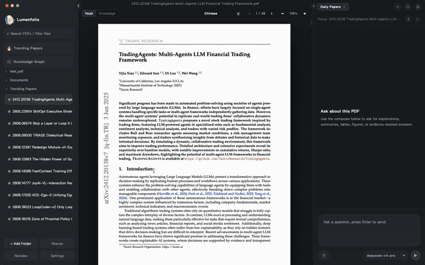
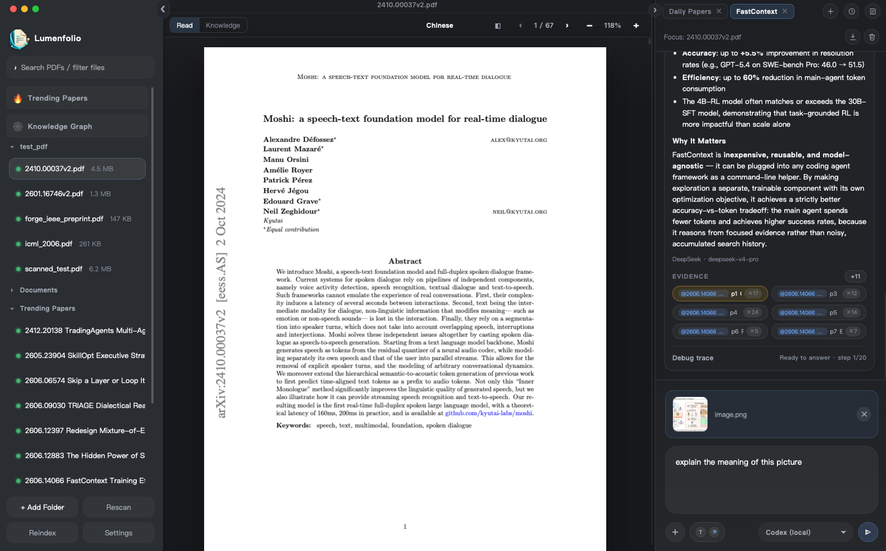
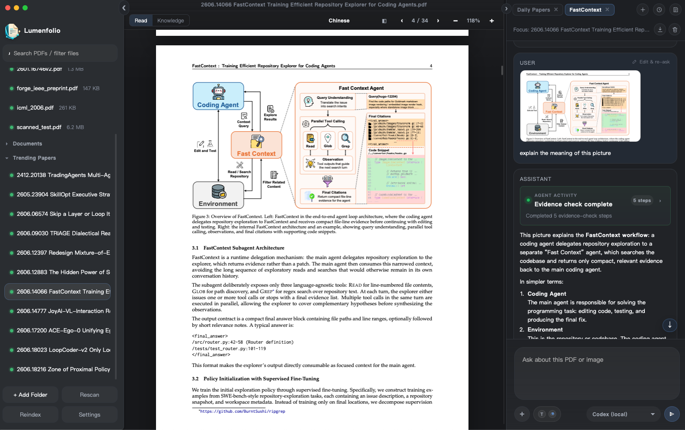

<div align="center">
  
  <h1>Lumenfolio</h1>
  <p><strong>A local-first AI knowledge base — your second brain, fed by everything you read.</strong></p>
  <p>Collect PDFs, Office files, web pages and your own notes; write and link them in the app; then ask your whole library and get answers with citations that jump back to the source.</p>
  <p>
    <a href="https://github.com/tanghui315/lumenfolio/releases/latest"><strong>Download</strong></a>
    ·
    <a href="./resources/screenshot/lumenfolio-demo-cut-speed-compact.gif"><strong>Watch 30s Demo</strong></a>
    ·
    <a href="https://github.com/tanghui315/lumenfolio/stargazers"><strong>Star on GitHub</strong></a>
    ·
    <a href="https://github.com/tanghui315/lumenfolio/issues"><strong>Give Feedback</strong></a>
  </p>
  <p>Available for macOS Intel, macOS Apple Silicon, and Windows x86_64.</p>
  <p><a href="./README.zh-CN.md">中文文档 (Chinese README)</a></p>
</div>

Lumenfolio is a local-first desktop knowledge base with an AI agent that can actually read it. You bring in sources — PDFs, Word/Excel/PowerPoint files, web clips, Markdown, or notes you write yourself — and Lumenfolio indexes them into one searchable, linkable library on your machine.

The default loop is **ask your whole knowledge base**. Focusing on a single source is the option, not the requirement.

It is not "chat over a file". Answers are grounded in a local evidence layer — pages, blocks, chunks, structure, tables, visual regions, citations and bounding boxes — that points back at the exact place a claim came from. That same evidence layer can be exposed through local MCP tools, so a signed-in Codex / Claude Code CLI can gather evidence and answer inside your library.



If Lumenfolio is useful to you, a star helps other people find it.

## What Makes It Different

| Capability | Typical AI notes / PDF chat | Lumenfolio |
| --- | --- | --- |
| Scope | One file, or a notes app with no documents | One library: documents, web clips and authored notes, asked together |
| Evidence | Text snippets or loose citations | Page / bbox / slide / cell citations that jump back to the exact source region |
| Retrieval | Chunk + embedding + vector DB by default | Document structure + SQLite FTS + page/block evidence loop; vectorless by default |
| Privacy | Often uploads your documents to a hosted service | Local indexing first; cloud calls only to the provider you choose |
| Your data | Locked in a proprietary store | Notes mirrored as plain `.md` files; database snapshots you can restore |
| Writing | Read-only, or notes with no sources | A real Markdown editor with `[[wikilinks]]`, and an agent that can propose precise edits |

## Sources

Everything below becomes a first-class, askable source in the same library.

- **PDF** — indexed with page/bbox evidence, plus OCR for scanned files and layout-aware translation.
- **Office** — Word (`.docx`), Excel (`.xlsx`) and PowerPoint (`.pptx`), each previewed in-app and indexed for retrieval:
  - Word renders at high fidelity and its paragraphs are the retrieval unit.
  - Excel keeps merged cells and multi-level headers aligned, shows A1 row/column headers, and indexes each row as a self-describing record (`Region: West | Revenue: 3140`) plus the sheet's formulas — so a question can be answered by a row, and a cited row is highlighted in the grid.
  - PowerPoint renders real slide layouts, and indexes one block per slide including **speaker notes**, SmartArt and chart labels — often the fullest text in a deck. Slide pictures are registered as visual evidence, so a vision-capable model can read the diagrams too.
- **Web clips** — paste a URL and keep the readable article as a source.
- **Notes and Markdown** — write directly in the app, or import existing `.md`.

Sources are organised into **collections** (nestable folders), and both collections and sources can be dragged into whatever order you want. Filing is metadata only: nothing on disk is moved, and importing a file references it where it already lives.

## Ask Your Whole Knowledge Base

With no source selected, the centre of the app is the conversation — ask across everything you have collected.


- The agent searches the whole indexed library by topic, then routes retrieval into the right documents; large libraries are discovered on demand instead of being stuffed into the prompt.
- Type `@` — or drag a source from the sidebar into the composer — to pin specific sources to a question (up to 4 alongside the current one).
- Citations carry their source, page and bbox. Click one to jump back: a PDF scrolls to the highlighted region, a Word paragraph or an Excel row is highlighted in place.
- Search is CJK-aware: Chinese, Japanese and Korean text is segmented per character at index time, so a term in the middle of a phrase is findable — not only one anchored at the start.

Small talk short-circuits the retrieval loop, so "hello" answers instantly instead of running a search.

## Write, Link, and Let the Agent Help

Notes are not an afterthought — they are a source you author.

- A **WYSIWYG Markdown editor** (Milkdown/Crepe) with a Typora-like feel: live formatting, tables, code blocks, and LaTeX math.
- **`[[wikilinks]]`** between notes, with backlinks. A link to a note that does not exist yet creates it on click.
- **Autosave** — no Save button. New notes start title-first, like Obsidian.
- The agent can **read the note you are editing** and **propose precise edits**: it names the exact text to replace, you see a red/green diff of just those hunks, and nothing is applied until you accept. Edits are re-checked against your buffer at apply time, so anything you typed meanwhile survives — and a stale proposal is refused rather than overwriting your work.

The edit mechanism deliberately follows what shipped coding agents converged on (exact match, required uniqueness, no fuzzy fallbacks) — fuzzy matching is what makes an editor destroy the text it was asked to improve.

## Your Data Stays Yours

- **Notes are mirrored as plain `.md` files** in a folder you choose. Point it at iCloud, Dropbox, Syncthing or a WebDAV mount and your notes sync with no integration on our side — and no lock-in, since they are just Markdown. If the database is ever lost, the notes are still there, and can be recovered back into the app.
- **Database snapshots** capture what only exists in SQLite — collections, chat history, settings. Snapshots use `VACUUM INTO` (never a file copy, which is how a live SQLite database gets corrupted in a sync folder), are safe to take while you work, and restore on the next launch while keeping the database they replaced. Manual, or on a schedule you choose.
- Nothing leaves your machine except calls to the model provider you configured.

> A SQLite database must never live in a cloud-sync folder. That is why notes are mirrored as files and the database is snapshotted, rather than the app data directory simply being synced.

## Vectorless Agentic RAG

Lumenfolio's retrieval is vectorless by design: no embedding model, no vector database, no external retrieval service.

Each source is indexed into a local, inspectable evidence layer:

- pages/slides, text blocks, lines, and chunks
- a deterministic document structure tree
- SQLite FTS5 text search (CJK-aware)
- page and block bounding boxes
- table and visual evidence
- citation records with quote, page, and bbox metadata

At question time the agent uses retrieval tools rather than one opaque similarity lookup:

```text
Question
-> inspect document structure
-> open relevant sections
-> search local FTS chunks
-> open pages, neighbors, tables, and visual evidence
-> run an answerability / finalize gate
-> answer with citations and evidence trace
```

This is cheap to run locally, independent of embedding quality, and auditable. On models with native tool calling it runs as a single agent loop, so retrieval and answering share one growing context; models without tool calling fall back to a rule-driven path so weaker or local models keep working.

## Local Agent Providers (Codex / Claude Code)

Lumenfolio can turn locally installed Codex and Claude Code CLIs into chat models. If you are already signed in from the terminal, they appear in the model picker as `Codex (local)` / `Claude Code (local)`.

- **No separate API key** — it uses the CLI you have already signed into.
- **Auto-detection and connection test**, with install status, version and an end-to-end MCP check in Settings.
- **Mode A: evidence-then-generate** — Lumenfolio retrieves evidence first, then asks the local agent to answer from it.
- **Mode B: agentic MCP retrieval** — the local agent calls Lumenfolio's read-only MCP tools to search passages, open pages/sections, and inspect tables and visual evidence before answering.
- **Live tool trace** in the chat activity stream.
- **Scoped safety boundary** — the MCP server starts per turn on `127.0.0.1` with a random bearer token and exposes read-only tools.

## Multimodal Chat

Paste or attach a screenshot, figure, table, diagram or equation crop and ask a vision-capable model about it in the context of your current session.





## Agent Sessions

The agent area is an independent multi-session workspace, not a chat box bolted onto one file.

- Open multiple sessions and switch with tabs.
- A session is not bound to one source — set or change its focus, and pull in others with `@`.
- Conversation memory is per session, so each line of inquiry keeps its own context.

## Knowledge Precipitation and Cross-Document Graph

Lumenfolio turns a growing library into a connected knowledge base instead of a folder of isolated files.


- **Knowledge precipitation** distills each source into a summary, entities, concepts and keywords — one sampled LLM pass after indexing, plus a near-zero-cost stream that reuses the structured output of each chat turn. Cached and local.
- A **Knowledge tab** shows the current source as a concept-bridge graph: the source in the centre, its salient concepts around it, related sources on the outer ring, and the shared concepts drawn as the bridge.
- A full-screen **Knowledge Graph** renders the whole library with communities, focus/ego mode, search, and structural insights (surprising connections, bridge documents, knowledge gaps).
- Sources are linked by **shared concepts** and by **conversation co-citation** — documents the agent cited together in one answer — so relationships reflect both content and how you actually read.

## Visual Evidence, OCR and Tables

Important evidence often lives in figures, charts and tables rather than prose.

Lumenfolio identifies visual assets, renders crops, and keeps them available to the agent as source-grounded evidence. For tables, a Table Structure Recognition (TSR) path can turn table regions into structured cells and searchable table facts when a local TSR model is configured.

Release builds ship the visual/table evidence workflow. Local OCR for scanned/image-only PDFs is bundled on macOS Apple Silicon and Windows; the optional ONNX TSR model is not bundled by default yet.

## Translation

For PDFs, Lumenfolio supports both quick selection translation and document-level translation through a bundled PDFMathTranslate sidecar, aiming to preserve layout — formulas, figures, tables, double-column structure, pagination and bilingual output.


- selected-text translation while reading
- page/document translation jobs with progress and cancellation
- translated and bilingual PDF outputs
- original / translated / side-by-side reading modes

## Trending Papers (optional)

An optional, local-first discovery feed of trending papers from Hugging Face, with Daily/Weekly/Monthly scopes and one-click add into your library. Nothing is fetched until you open it, and a PDF is downloaded only on an explicit add. It is a side utility, not the centre of the app — turn it off in Settings and the entry disappears.

## Features

- Knowledge base of mixed sources: PDF, Word, Excel, PowerPoint, web clips, Markdown and authored notes
- Nestable collections with drag-and-drop filing and manual ordering
- Library-wide agentic Q&A, with `@`-mention or drag-to-reference for specific sources
- In-app Markdown editor with wikilinks, backlinks, math, autosave and title-first creation
- Agent-assisted writing: read the current note and propose precise, reviewable edits
- Notes mirrored to plain `.md` files; database snapshots with scheduled backup and restore
- Vectorless agentic RAG over a local evidence layer, with citations that jump back to the source
- CJK-aware full-text search
- Native tool-calling agent loop for capable models, rule-driven fallback for weaker/local ones
- Local agent providers: auto-detect Codex / Claude Code and use them without another API key
- Local-agent MCP mode with read-only evidence tools and a live trace
- Multimodal chat for figures, tables, diagrams and screenshots
- Knowledge precipitation and a cross-document knowledge graph
- Visual/table-aware retrieval with rendered crops and TSR-ready table evidence
- Local OCR for scanned PDFs (macOS Apple Silicon, Windows)
- Layout-aware PDF translation via a PDFMathTranslate sidecar
- Optional trending-papers discovery feed

## Architecture

Lumenfolio is a Tauri 2 + Vue 3 desktop app.


- Frontend: Vue 3 + Vite
- Desktop runtime: Tauri 2
- Backend: Rust
- Storage: SQLite in the local app data directory, plus `.md` note files in your chosen folder
- PDF rendering: `pdfjs-dist`
- Office preview: `docx-preview`, `exceljs`, `@aiden0z/pptx-renderer`
- Note editor: Milkdown / Crepe
- Translation sidecar: bundled PDFMathTranslate runtime

Key paths:

- `src/App.vue`: top-level app orchestration
- `src/components/WorkspaceSidebar.vue`: collection tree, filing and ordering
- `src/components/NoteEditor.vue`: Markdown editor, wikilinks, agent edit apply
- `src/components/OfficeViewer.vue`: docx / xlsx / pptx preview and citation anchoring
- `src-tauri/src/lib.rs`: Tauri command surface and runtime setup
- `src-tauri/src/office.rs`: Office text, formula, notes and media extraction
- `src-tauri/src/vault.rs`: Markdown mirror of notes
- `src-tauri/src/backup.rs`: database snapshots and restore
- `src-tauri/src/search_text.rs`: CJK-aware FTS indexing and query building
- `src-tauri/src/runtime/rag/`: retrieval and evidence assembly
- `src-tauri/src/runtime/agent/`: turn runner, policy gate, session memory, ledger, trace
- `src-tauri/src/runtime/note_edit.rs`: precise note-edit matching
- `src-tauri/src/local_agent/mcp_server.rs`: loopback MCP tool server for local agents
- `docs/knowledge_base_pivot_plan.md`: the historical plan behind the knowledge-base pivot, with a summary of what shipped beyond it

## Prerequisites

- Node.js 18+ (LTS recommended)
- npm 9+
- Rust stable toolchain
- Platform requirements for Tauri 2 (macOS/Linux/Windows build dependencies)

## Quick Start

```bash
npm install
npm run tauri:dev
```

For browser-only UI iteration:

```bash
npm run dev
```

## Build & Verification

```bash
npm run build
cd src-tauri && cargo test
```

Additional project checks:

```bash
npm run check:translation-linking
npm run check:prod-no-testids
```

## Trust, Data & Installation

- Lumenfolio is local-first. Indexes, notes, chat history and translation metadata are stored locally.
- Notes are additionally written as plain `.md` files in the folder you choose, and the database can be snapshotted to a folder you choose.
- API keys are currently stored locally; migration to the system keychain is planned.
- If a cloud chat or translation provider is configured, selected text, questions, page context or translation content may be sent to that provider.
- If you choose a local Codex / Claude Code provider, questions, conversation memory and retrieved evidence are passed to that local CLI; the model request is handled by the CLI and its signed-in account.
- macOS builds are currently ad-hoc signed. Developer ID signing and notarization are planned.
- Release assets include SHA-256 checksums plus license, notice, AGPL sidecar license, and PDFMathTranslate source archive.

## Acknowledgements

- [`PDFMathTranslate`](https://github.com/PDFMathTranslate/PDFMathTranslate) for its translation capabilities and engineering inspiration.
- [`Milkdown`](https://milkdown.dev/) for the WYSIWYG Markdown editing experience.
- [`pptx-renderer`](https://github.com/aiden0z/pptx-renderer) for browser-native PowerPoint rendering.

## License

This project is licensed under the GNU Affero General Public License v3.0, matching the bundled PDFMathTranslate/pdf2zh sidecar.
