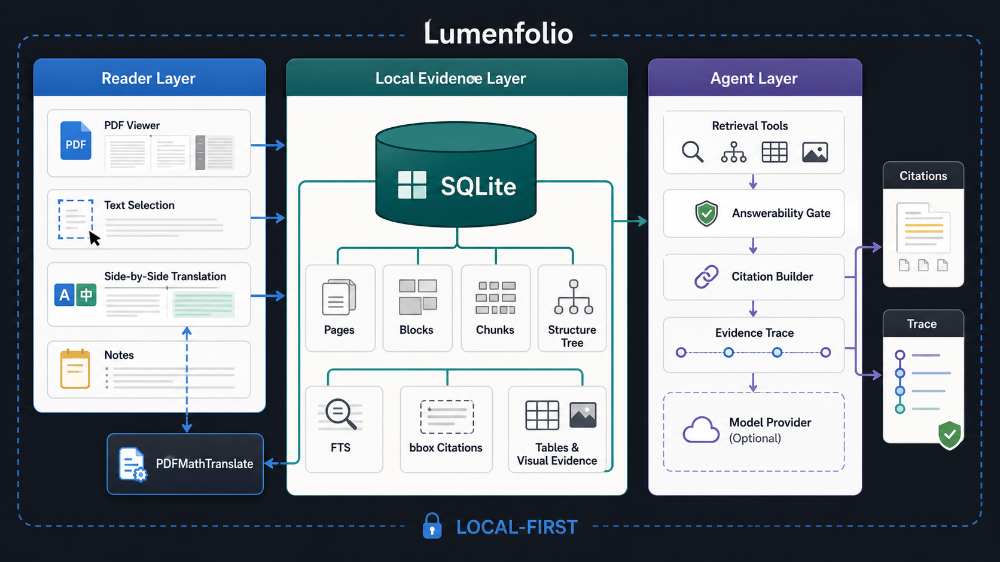

<div align="center">
  
  <h1>Lumenfolio</h1>
  <p><strong>本地优先的 AI 个人知识库——你的第二大脑，由你读过的一切喂养。</strong></p>
  <p>收进 PDF、Office 文档、网页与你自己的笔记；在应用内书写并互相链接；然后向整个知识库提问，得到能跳回原文的带引用答案。</p>
  <p>
    <a href="https://github.com/tanghui315/lumenfolio/releases/latest"><strong>下载应用</strong></a>
    ·
    <a href="https://github.com/tanghui315/lumenfolio/stargazers"><strong>给项目 Star</strong></a>
    ·
    <a href="https://github.com/tanghui315/lumenfolio/issues"><strong>反馈问题</strong></a>
  </p>
  <p>支持 macOS Intel、macOS Apple Silicon 和 Windows x86_64。</p>
  <p><a href="./README.md">English README</a></p>
</div>

Lumenfolio 是一个本地优先的桌面知识库，并配备一个真正读得懂它的 AI agent。你把来源收进来——PDF、Word/Excel/PowerPoint、网页剪藏、Markdown，或你自己写的笔记——Lumenfolio 在本机把它们索引成一个可检索、可互链的知识库。

默认主循环是**向整个知识库提问**。聚焦到单个来源是可选项，而不是前提。

它不是「对着一个文件聊天」。答案建立在本地证据层之上——页面、文本块、切片、结构、表格、视觉区域、引用与坐标框——能指回一句话的确切出处。同一套证据层还能通过本地 MCP 工具暴露出去，让你已经登录的 Codex / Claude Code CLI 在你的知识库里多步取证并作答。

如果 Lumenfolio 对你有用，点个 Star 能帮到更多人发现它。

## 与同类产品的差别

| 能力 | 常见的 AI 笔记 / PDF 对话 | Lumenfolio |
| --- | --- | --- |
| 范围 | 单个文件，或没有文档的笔记应用 | 一个知识库：文档、网页剪藏与手写笔记一起问 |
| 证据 | 文本片段或松散引用 | 页 / 坐标框 / 幻灯片 / 单元格级引用，可跳回原文精确位置 |
| 检索 | 默认切片 + 向量化 + 向量库 | 文档结构 + SQLite 全文检索 + 页/块证据循环；**默认无向量** |
| 隐私 | 常需把文档上传到托管服务 | 本地索引优先；只有你配置的模型提供商会收到调用 |
| 数据归属 | 锁死在私有存储里 | 笔记镜像为纯 `.md` 文件；数据库快照可随时恢复 |
| 书写 | 只读，或有笔记但没有来源 | 真正的 Markdown 编辑器 + `[[双链]]`，agent 还能提出精准修改 |

## 支持的来源

以下每一种都会成为知识库里平等的、可提问的来源。

- **PDF** —— 带页/坐标框证据的索引，扫描件可 OCR，并支持保留版式的翻译。
- **Office** —— Word（`.docx`）、Excel（`.xlsx`）、PowerPoint（`.pptx`），均可在应用内预览并被索引：
  - Word 高保真渲染，段落即检索单元。
  - Excel 正确处理**合并单元格与多级表头**，带吸顶的 A1 行号列标；每一行索引成**自描述记录**（`Region: West | Revenue: 3140`），并额外索引该表的**公式**——所以一行就能回答一个问题，被引用的行还会在表格里高亮。
  - PowerPoint 渲染真实版式，并**按页**索引，包含**演讲者备注**、SmartArt 与图表文字——备注往往是一份 deck 里信息最完整的部分。幻灯片图片会登记为视觉证据，支持视觉的模型可以直接看图。
- **网页剪藏** —— 粘贴 URL，把正文留存为一个来源。
- **笔记与 Markdown** —— 在应用内直接书写，或导入已有的 `.md`。

来源用**集合**（可嵌套的文件夹）组织，集合与来源都可以**拖拽排序**。归档只是元数据：磁盘上的文件不会被移动，导入是**原地引用**它本来的位置。

## 向整个知识库提问

没有选中任何来源时，应用中央就是对话——面向你收集的全部内容提问。

- Agent 先按主题检索整个知识库，再把检索路由到正确的文档；库很大时按需发现，而不是把全部塞进 prompt。
- 输入 `@`——或**把来源从侧栏拖进输入框**——即可为这个问题钉住特定来源（除当前来源外最多 4 个）。
- 引用带着来源、页码与坐标框。点击即可跳回：PDF 滚动到高亮区域，Word 段落或 Excel 行会就地高亮。
- **检索支持中日韩**：索引时按字切分，所以**词组中间的词也能搜到**，而不是只有从开头匹配才行。

寒暄会短路检索循环——说「你好」即刻作答，不会白跑一轮检索。

## 书写、互链，并让 agent 帮你改

笔记不是附属功能，而是一种由你创作的来源。

- **所见即所得的 Markdown 编辑器**（Milkdown/Crepe），接近 Typora 的手感：实时排版、表格、代码块与 LaTeX 公式。
- 笔记之间的 **`[[双向链接]]`** 与反链。链接到尚不存在的笔记，点击即可创建。
- **自动保存**，没有保存按钮。新建笔记「标题优先」，与 Obsidian 一致。
- Agent 能**读取你正在编辑的笔记**并**提出精准修改**：它指明要替换的确切文本，你看到的是只含改动的**红/绿分块 diff**，**你不点应用就不会写入**。应用时会对照你当前的缓冲区**重新校验**，所以这期间你敲的字不会丢——过期的提议会被**明确拒绝**，而不是覆盖你的成果。

这套修改机制刻意沿用了已上线编程 agent 收敛出的结论（精确匹配、要求唯一、不做模糊回退）——正是模糊匹配会让「帮你改文章」变成「毁掉你的文章」。

## 你的数据仍归你

- **笔记镜像为纯 `.md` 文件**，存放在你指定的文件夹。把它指向 iCloud、Dropbox、坚果云或 WebDAV 挂载点，笔记就自动同步——**我们不写一行同步代码**，也没有锁定，因为它就是 Markdown。即使数据库丢了，笔记仍在，并能恢复回应用。
- **数据库快照**负责只存在于 SQLite 里的部分——集合分类、聊天记录、设置。快照使用 `VACUUM INTO`（**绝不拷贝文件**——把正在使用的 SQLite 放进同步目录正是数据库损坏的经典原因），**使用中也能安全生成**；恢复在下次启动时生效，并保留被替换的那份数据库。可手动，也可设定周期。
- 除了你自己配置的模型提供商，没有任何数据离开这台机器。

> SQLite 数据库**绝不能**直接放进云盘同步目录。这正是我们选择「笔记落盘为文件 + 数据库做快照」，而不是简单同步整个数据目录的原因。

## 无向量的 Agentic RAG

Lumenfolio 的检索**天生不依赖向量**：不需要 embedding 模型、向量数据库或外部检索服务。

每个来源都会被索引成一个本地、可审查的证据层：

- 页面/幻灯片、文本块、行与切片
- 确定性的文档结构树
- SQLite FTS5 全文检索（支持中日韩）
- 页面与块的坐标框
- 表格与视觉证据
- 带引文、页码与坐标框的引用记录

提问时，agent 使用一组检索工具，而不是一次不透明的相似度查询：

```text
问题
-> 检查文档结构
-> 打开相关章节
-> 检索本地 FTS 切片
-> 打开页面、相邻块、表格与视觉证据
-> 走可答性 / 收敛判定
-> 带引用与证据轨迹作答
```

这让检索在本地跑得起、不受 embedding 质量牵制，也易于审查。在支持原生工具调用的模型上，它是**单一 agent 循环**——检索与作答共享同一份不断增长的上下文；不支持工具调用的模型会回落到规则驱动路径，因此较弱的或本地的模型依然可用。

## 本地 Agent 提供商（Codex / Claude Code）

Lumenfolio 可以把本机安装的 Codex 与 Claude Code CLI 变成聊天模型。如果你已在终端登录，它们会以 `Codex (local)` / `Claude Code (local)` 出现在模型选择器中。

- **无需另配 API Key** —— 直接用你已经登录的 CLI。
- **自动探测与连通性测试** —— 设置页展示安装状态、版本与端到端 MCP 测试。
- **模式 A：先取证再生成** —— Lumenfolio 先检索证据，再让本地 agent 据此作答。
- **模式 B：agent 自主 MCP 检索** —— 本地 agent 调用 Lumenfolio 的只读 MCP 工具，自行检索段落、打开页面/章节、查看表格与视觉证据后再作答。
- **实时工具轨迹**，在对话的活动流中可见。
- **受限的安全边界** —— MCP 服务按轮次启动于 `127.0.0.1`，使用随机 bearer token，且只暴露只读工具。

## 多模态对话

粘贴或附加截图、图表、表格、示意图或公式截图，让支持视觉的模型结合当前会话上下文解读它。

## Agent 会话

右侧是独立的多会话工作区，而不是挂在某个文件上的聊天框。

- 可开多个会话，用标签页切换。
- 会话**不绑定**单个来源——可以设置或更换聚焦对象，并用 `@` 引入其他来源。
- 对话记忆按会话隔离，每条思路各自保有上下文。

## 知识沉淀与跨文档图谱

Lumenfolio 让不断增长的资料变成互相连接的知识库，而不是一堆孤立文件。

- **知识沉淀**把每个来源析出摘要、实体、概念与关键词——索引后一次采样的 LLM 调用，加上一条几乎零成本的流（复用每轮对话的结构化输出）。带缓存，全本地。
- **Knowledge 标签页**把当前来源画成概念桥接图：来源居中、显著概念环绕、相关来源在外圈，共享概念作为「桥」画出来，一眼看出「为什么相关」。
- 全屏**知识图谱**渲染整个知识库，含社区划分、聚焦/自我模式、搜索，以及结构性洞察（意外连接、桥梁文档、知识空白）。
- 来源之间通过**共享概念**与**对话共引**（agent 在同一个回答里同时引用过的文档）建立关联，因此关系既反映内容，也反映你实际的阅读方式。

## 视觉证据、OCR 与表格

重要信息常常藏在图、表里，而不在正文。

Lumenfolio 会识别视觉资产、渲染裁剪图，并把它们作为有出处的证据交给 agent。对于表格，在配置了本地 TSR 模型后，表格结构识别（TSR）路径可以把表格区域还原成结构化单元格与可检索的表格事实。

发行版已包含视觉/表格证据流程。扫描件/纯图片 PDF 的本地 OCR 在 macOS Apple Silicon 与 Windows 上随包提供；可选的 ONNX TSR 模型暂未默认打包。

## 翻译

针对 PDF，Lumenfolio 同时支持划词快速翻译与整篇文档翻译（内置 PDFMathTranslate sidecar），目标是尽可能保留版式——公式、图表、双栏结构、分页与双语输出。

- 阅读中的划词翻译
- 按页/整篇的翻译任务，带进度与取消
- 译文 PDF 与双语 PDF 产物
- 原文 / 译文 / 左右对照三种阅读模式

## 热门论文（可选）

一个可选的、本地优先的 Hugging Face 热门论文发现流，支持每日/每周/每月，一键加入知识库。**不打开就不会联网**，只有明确「添加」时才会下载 PDF。它是侧边工具而非应用中心——在设置里关掉，入口即消失。

## 功能一览

- 多来源知识库：PDF、Word、Excel、PowerPoint、网页剪藏、Markdown 与手写笔记
- 可嵌套集合，支持拖拽归档与手动排序
- 全库 agentic 问答，可用 `@` 或拖拽指定特定来源
- 应用内 Markdown 编辑器：双链、反链、公式、自动保存、标题优先新建
- Agent 辅助写作：读取当前笔记并提出可审阅的精准修改
- 笔记镜像为 `.md` 文件；数据库快照支持定期备份与恢复
- 基于本地证据层的无向量 agentic RAG，引用可跳回原文
- 支持中日韩的全文检索
- 强模型走原生工具调用循环，弱模型/本地模型回落到规则驱动路径
- 本地 agent 提供商：自动探测 Codex / Claude Code，无需另配 API Key
- 本地 agent 的 MCP 模式，只读证据工具 + 实时轨迹
- 多模态对话：图、表、示意图与截图
- 知识沉淀与跨文档知识图谱
- 视觉/表格感知检索，含裁剪图与 TSR 表格证据
- 扫描件 PDF 的本地 OCR（macOS Apple Silicon、Windows）
- 基于 PDFMathTranslate sidecar 的保版式翻译
- 可选的热门论文发现流

## 架构

Lumenfolio 是一个 Tauri 2 + Vue 3 桌面应用。



- 前端：Vue 3 + Vite
- 桌面运行时：Tauri 2
- 后端：Rust
- 存储：本地应用数据目录中的 SQLite，以及你指定文件夹里的 `.md` 笔记文件
- PDF 渲染：`pdfjs-dist`
- Office 预览：`docx-preview`、`exceljs`、`@aiden0z/pptx-renderer`
- 笔记编辑器：Milkdown / Crepe
- 翻译 sidecar：内置 PDFMathTranslate 运行时

关键路径：

- `src/App.vue`：顶层应用编排
- `src/components/WorkspaceSidebar.vue`：集合树、归档与排序
- `src/components/NoteEditor.vue`：Markdown 编辑器、双链、agent 修改的应用
- `src/components/OfficeViewer.vue`：docx / xlsx / pptx 预览与引用定位
- `src-tauri/src/lib.rs`：Tauri 命令面与运行时装配
- `src-tauri/src/office.rs`：Office 文本、公式、备注与媒体抽取
- `src-tauri/src/vault.rs`：笔记的 Markdown 镜像
- `src-tauri/src/backup.rs`：数据库快照与恢复
- `src-tauri/src/search_text.rs`：中日韩感知的 FTS 索引与查询构造
- `src-tauri/src/runtime/rag/`：检索与证据组装
- `src-tauri/src/runtime/agent/`：轮次执行器、策略门、会话记忆、账本、轨迹
- `src-tauri/src/runtime/note_edit.rs`：笔记精准修改的匹配
- `src-tauri/src/local_agent/mcp_server.rs`：面向本地 agent 的回环 MCP 工具服务

## 环境要求

- Node.js 18+（推荐 LTS）
- npm 9+
- Rust stable 工具链
- Tauri 2 的各平台构建依赖（macOS/Linux/Windows）

## 快速开始

```bash
npm install
npm run tauri:dev
```

仅在浏览器中迭代 UI：

```bash
npm run dev
```

## 构建与验证

```bash
npm run build
cd src-tauri && cargo test
```

其他项目检查：

```bash
npm run check:translation-linking
npm run check:prod-no-testids
```

## 信任、数据与安装

- Lumenfolio 本地优先。索引、笔记、聊天记录与翻译元数据都保存在本地。
- 笔记会额外写入你指定文件夹中的 `.md` 文件；数据库也可快照到你指定的文件夹。
- API Key 目前保存在本地，后续计划迁移到系统钥匙串。
- 若配置了云端聊天或翻译提供商，选中的文本、问题、页面上下文或翻译内容可能会发送给该提供商。
- 若选择本地 Codex / Claude Code 提供商，问题、对话记忆与检索到的证据会传给该本地 CLI；实际的模型请求由 CLI 及其已登录账号处理。
- macOS 构建目前为 ad-hoc 签名，后续计划进行 Developer ID 签名与公证。
- 发行资产包含 SHA-256 校验和，以及许可证、声明、AGPL sidecar 许可与 PDFMathTranslate 源码归档。

## 致谢

- [`PDFMathTranslate`](https://github.com/PDFMathTranslate/PDFMathTranslate)：翻译能力与相关工程启发。
- [`Milkdown`](https://milkdown.dev/)：所见即所得的 Markdown 编辑体验。
- [`pptx-renderer`](https://github.com/aiden0z/pptx-renderer)：浏览器原生的 PowerPoint 渲染。

## 许可证

本项目采用 GNU Affero General Public License v3.0，与内置的 PDFMathTranslate/pdf2zh sidecar 保持一致。
